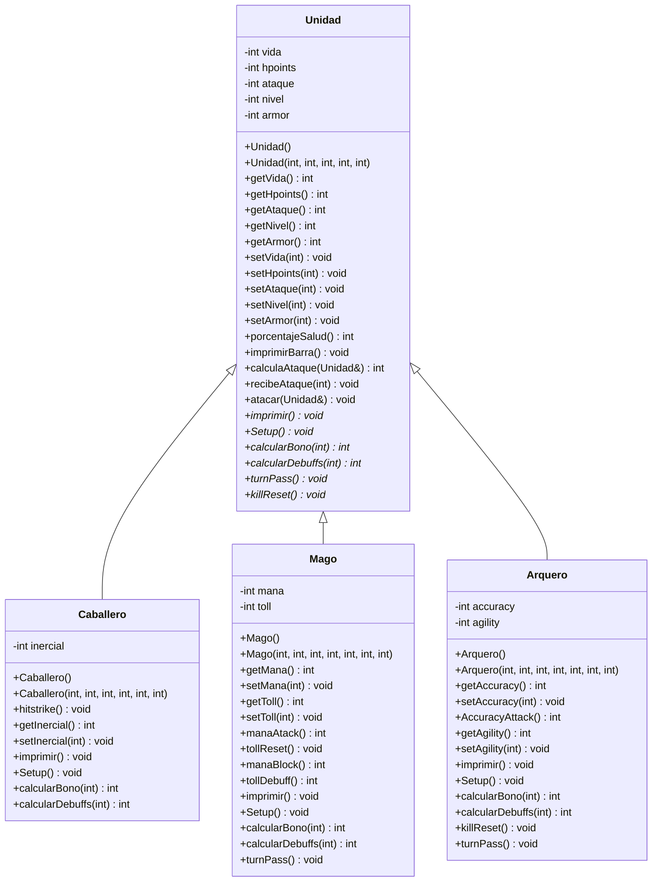

```mermaid
classDiagram
    class Unidad {
        -int vida
        -int hpoints
        -int ataque
        -int nivel
        -int armor
        +Unidad()
        +Unidad(int, int, int, int, int)
        +getVida() int
        +getHpoints() int
        +getAtaque() int
        +getNivel() int
        +getArmor() int
        +setVida(int) void
        +setHpoints(int) void
        +setAtaque(int) void
        +setNivel(int) void
        +setArmor(int) void
        +porcentajeSalud() int
        +imprimirBarra() void
        +calculaAtaque(Unidad&) int
        +recibeAtaque(int) void
        +atacar(Unidad&) void
        +imprimir()* void
        +Setup()* void
        +calcularBono(int)* int
        +calcularDebuffs(int)* int
        +turnPass()* void
        +killReset()* void
    }
 
    class Caballero {
        -int inercial
        +Caballero()
        +Caballero(int, int, int, int, int, int)
        +hitstrike() void
        +getInercial() int
        +setInercial(int) void
        +imprimir() void
        +Setup() void
        +calcularBono(int) int
        +calcularDebuffs(int) int
    }
 
    class Mago {
        -int mana
        -int toll
        +Mago()
        +Mago(int, int, int, int, int, int, int)
        +getMana() int
        +setMana(int) void
        +getToll() int
        +setToll(int) void
        +manaAtack() int
        +tollReset() void
        +manaBlock() int
        +tollDebuff() int
        +imprimir() void
        +Setup() void
        +calcularBono(int) int
        +calcularDebuffs(int) int
        +turnPass() void
    }
 
    class Arquero {
        -int accuracy
        -int agility
        +Arquero()
        +Arquero(int, int, int, int, int, int, int)
        +getAccuracy() int
        +setAccuracy(int) void
        +AccuracyAttack() int
        +getAgility() int
        +setAgility(int) void
        +imprimir() void
        +Setup() void
        +calcularBono(int) int
        +calcularDebuffs(int) int
        +killReset() void
        +turnPass() void
    }
 
    Unidad <|-- Caballero
    Unidad <|-- Mago
    Unidad <|-- Arquero
 

```
