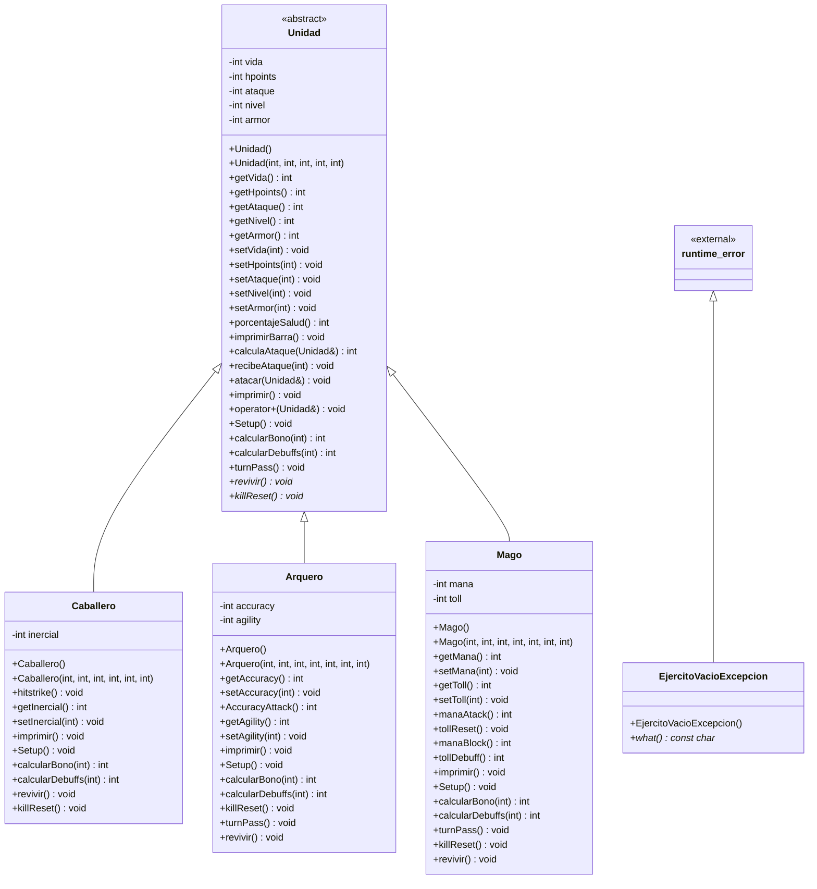

A00844976 

GAEL EMILIANO VILLATORO PEREZ

## INTRODUCCION
Este proyecto fue trabajado a traves de este periodo de verano, donde fue desarrollado poco a poco una simulacion de batallas, desde la creacion de las clases hijos hasta la creacion de excepciones, el proposito de este proyecto es la desarrollo de un simulador de batallas con diferentes clases de unidades, las cuales son caballeros, magos y arqueros, cada uno con sus diferentes atributos, pros y contras.

Este proyecto cuenta con herencia, polimorfismo, clases abstractas, sobrecarga de operadores y excepciones, ademas de sintaxis de codigo de c++.
## COMO APLICAMOS LAS TECNICAS

HERENCIA -- AL USAR LAS CLASES HIJOS ARQUERO,MAGO, Y CABALLERO

POLIMORFISMO -- EN LAS DIFERENTES APLICACIONES DE LAS FUNCIONES VIRTUALES Y LOS OVERRIDES, DENTRO DE CADA UNA DE LAS CLASES HIJO

CLASES ABSTRACTAR -- LA CLASE UNIDAD ES ABSTRACTA

SOBRECARGA DE OPERADORES -- PARA EL OPERADOR +, PARA LA OPERACION DE ATACAR

EXCEPCIONES -- EN EL EXERCISE.CPP, PARA ACABAR EL CICLO DE ATAQUES Y EL LOOP DE LAS PELEAS  

## CONCLUSION

Llegue a este curso con el minimo conocimiento de c++, pero a traves de las diferentes actividades y el trabajo de investigacion logre aprender de gran manera c++, y este proyecto es el resumen de todas las practicas y actividades que estuve realizando y de todos mis aprendizajes, gracias a todo esto voy a poder seguir trabajando con mis actividades extrapersonales y dentro de mi carrera de mejor manera y con un lenguaje de programacion mas en mi inventario.

## REFERENCIAS
https://www-w3schools-com.translate.goog/cpp/cpp_exceptions.asp?_x_tr_sl=en&_x_tr_tl=es&_x_tr_hl=es&_x_tr_pto=tc
https://www-w3schools-com.translate.goog/cpp/cpp_polymorphism.asp?_x_tr_sl=en&_x_tr_tl=es&_x_tr_hl=es&_x_tr_pto=tc
https://learn.microsoft.com/es-es/cpp/cpp/operator-overloading?view=msvc-170

## UML

